# 🏗️ Django Ecommerce API Architecture

This document provides a comprehensive overview of the Django Ecommerce API architecture, including system design, data flow, and component interactions.

## 📋 Table of Contents

- [System Overview](#system-overview)
- [Architecture Patterns](#architecture-patterns)
- [Core Components](#core-components)
- [Data Flow](#data-flow)
- [API Design](#api-design)
- [Database Design](#database-design)
- [Security Architecture](#security-architecture)
- [Deployment Architecture](#deployment-architecture)

## 🎯 System Overview

The Django Ecommerce API is built using modern architectural patterns to ensure scalability, maintainability, and performance.

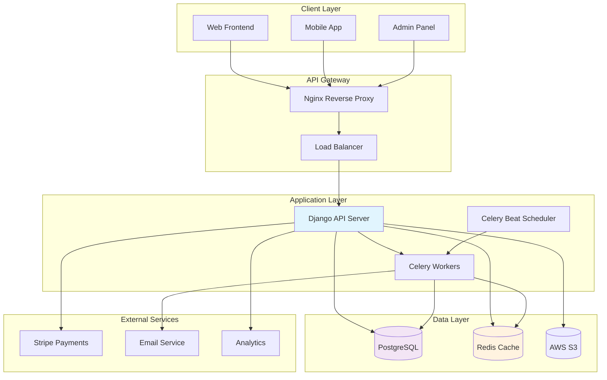

## 🔧 Architecture Patterns

### 1. Layered Architecture

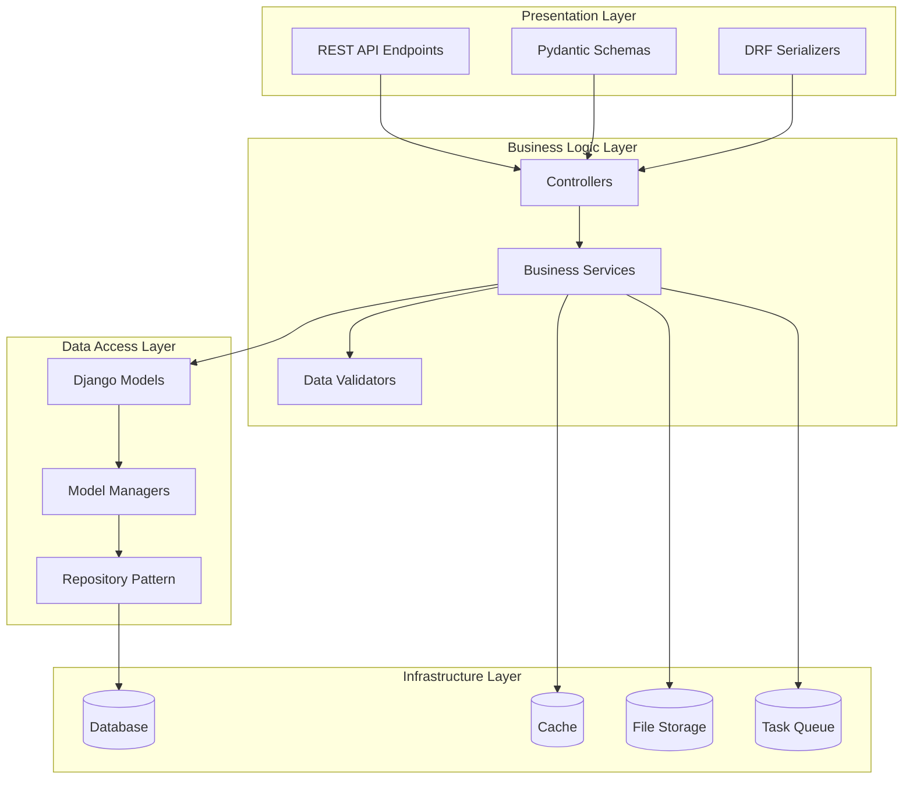

### 2. Domain-Driven Design (DDD)

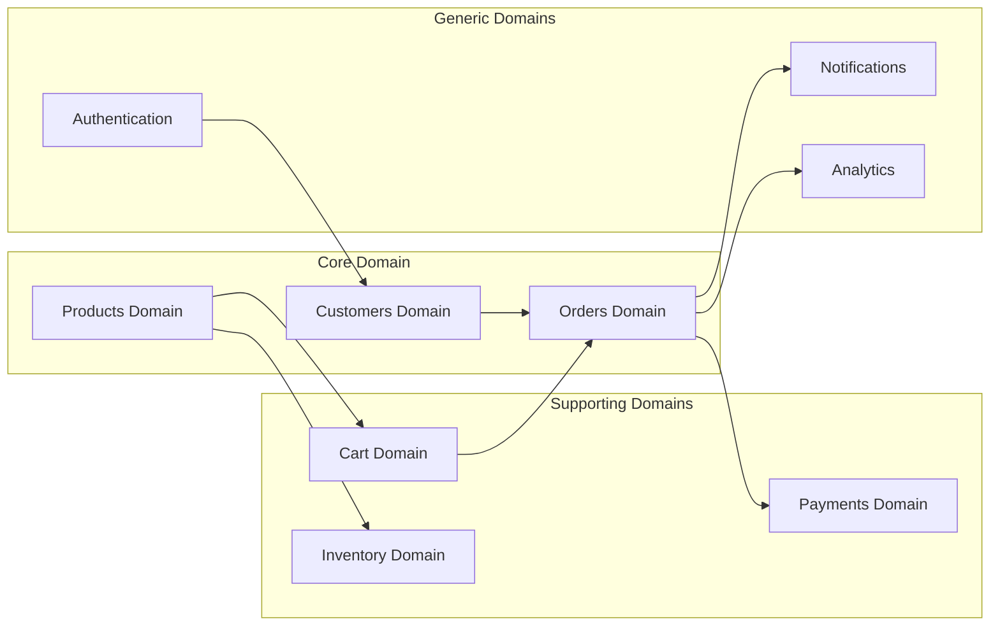

## 🧩 Core Components

### Application Structure

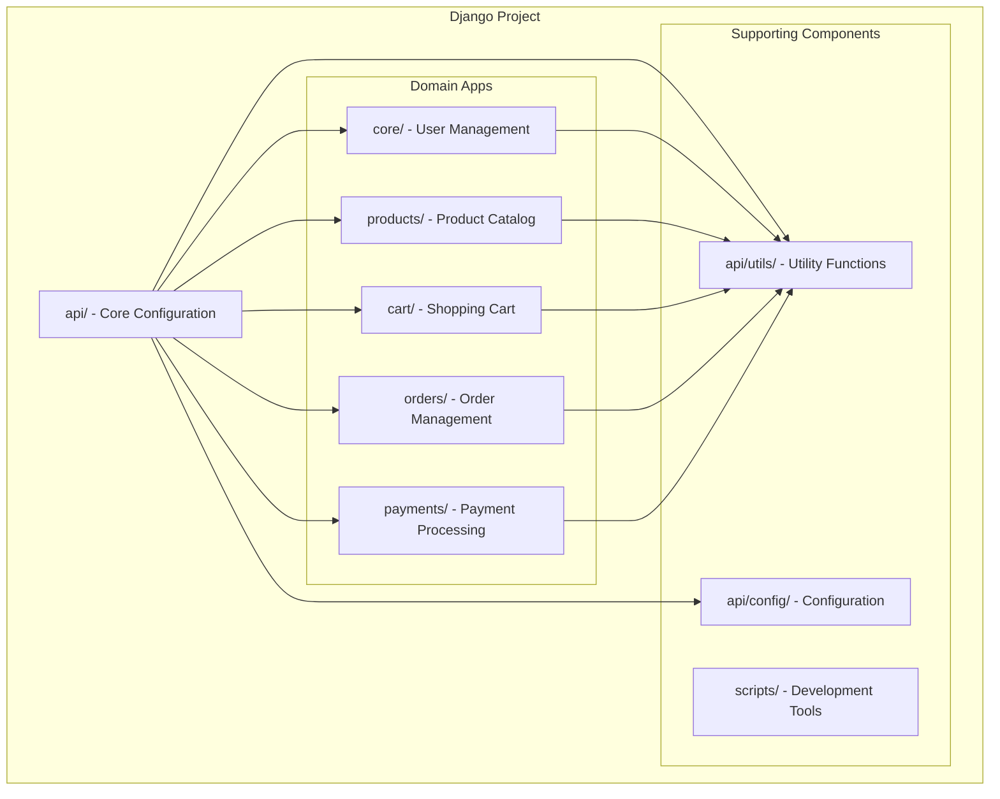

### Model Architecture

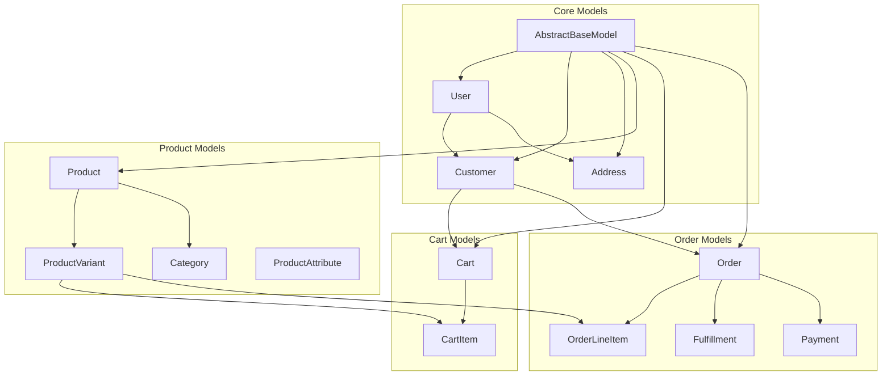

## 🌊 Data Flow

### Order Processing Flow

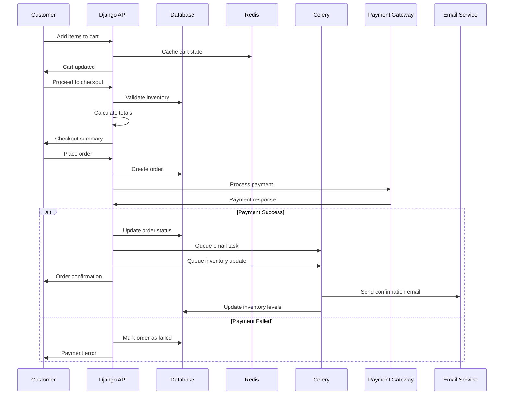

### Product Search Flow

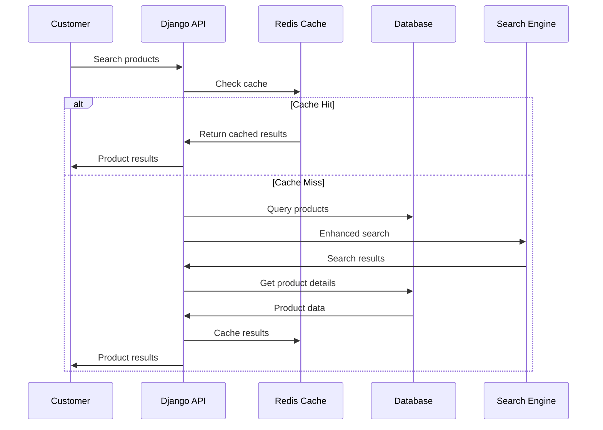

## 🔌 API Design

### RESTful API Structure

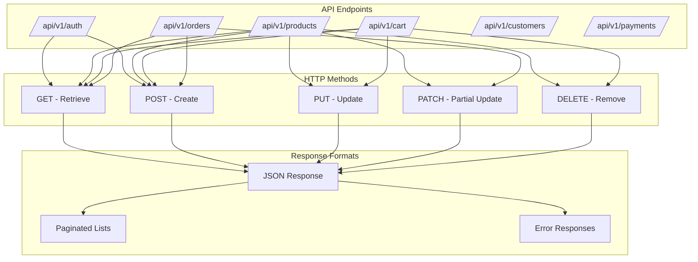

### Authentication & Authorization

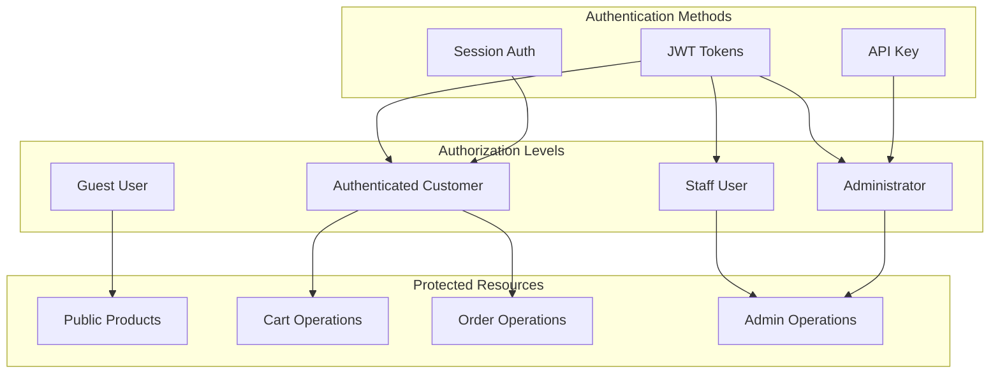

## 🗄️ Database Design

### Entity Relationship Diagram

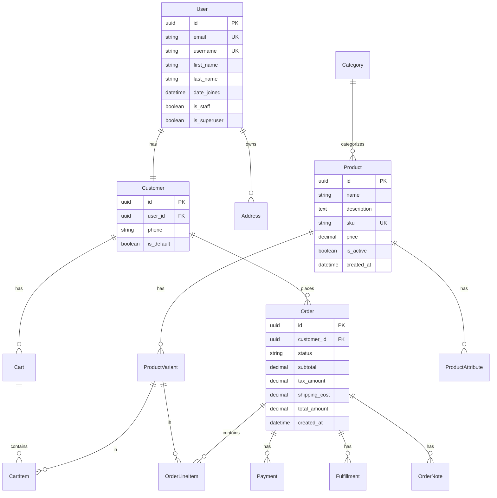

### Database Indexes Strategy

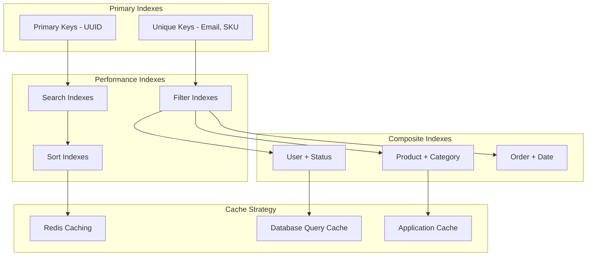

## 🔒 Security Architecture

### Security Layers

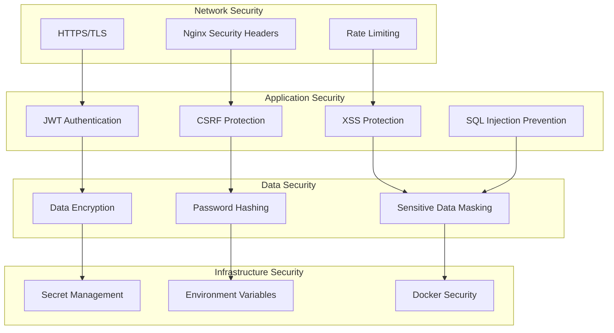

### Permission System

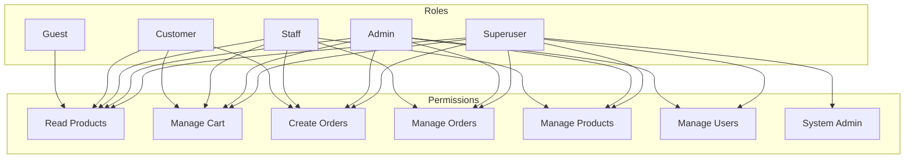

## 🚀 Deployment Architecture

### Container Architecture

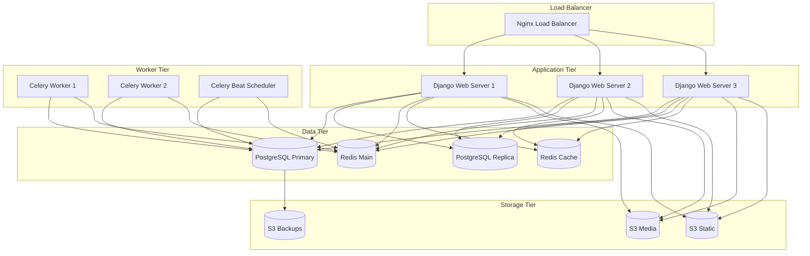

### Deployment Environments

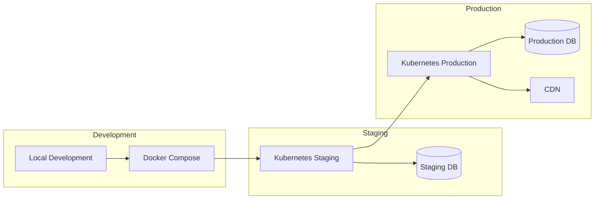

## 📊 Monitoring & Observability

### Monitoring Stack

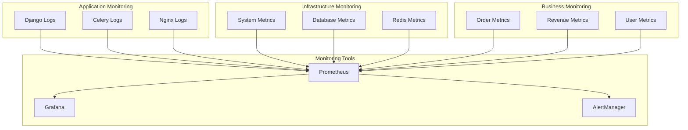

This architecture documentation provides a comprehensive overview of the Django Ecommerce API system design, ensuring scalability, maintainability, and performance for a modern e-commerce platform.
