# 👥 User Journeys & Customer Experience

This document outlines the key user journeys and customer experience flows in the Django Ecommerce API, providing detailed flowcharts and interaction patterns.

## 📋 Table of Contents

- [Customer Journey Overview](#customer-journey-overview)
- [Guest User Journey](#guest-user-journey)
- [Registered Customer Journey](#registered-customer-journey)
- [Admin User Journey](#admin-user-journey)
- [Mobile App Journey](#mobile-app-journey)
- [Error Handling Flows](#error-handling-flows)
- [Accessibility Considerations](#accessibility-considerations)

## 🎯 Customer Journey Overview

### Complete Customer Lifecycle

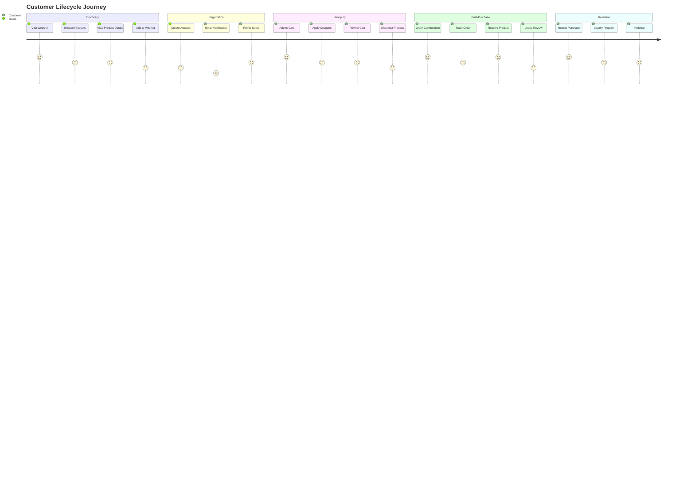

## 🛍️ Guest User Journey

### Product Discovery & Browsing

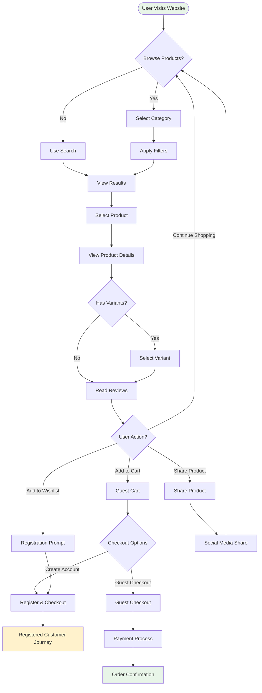

### Guest Checkout Flow

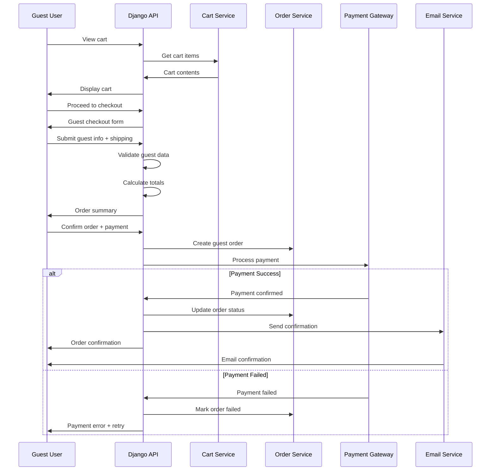

## 👤 Registered Customer Journey

### Registration & Onboarding

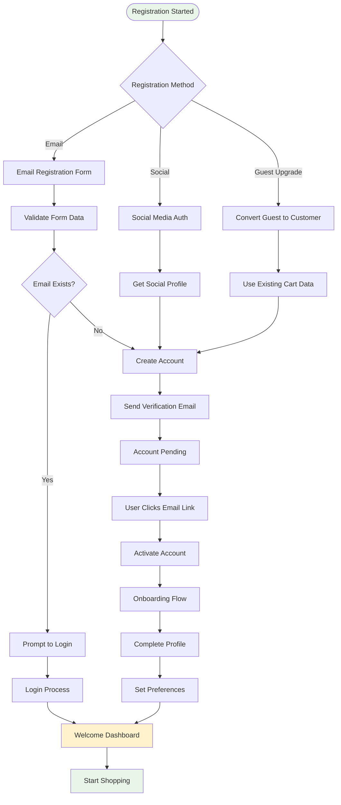

### Authenticated Shopping Experience

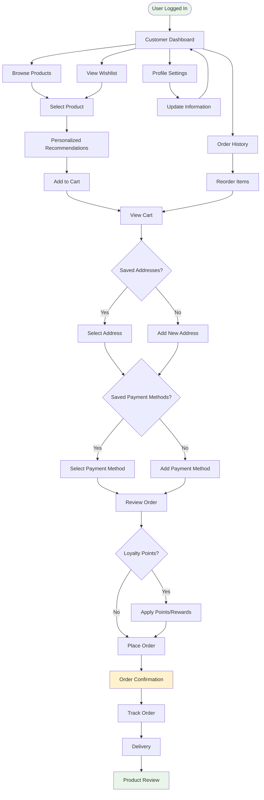

### Customer Account Management

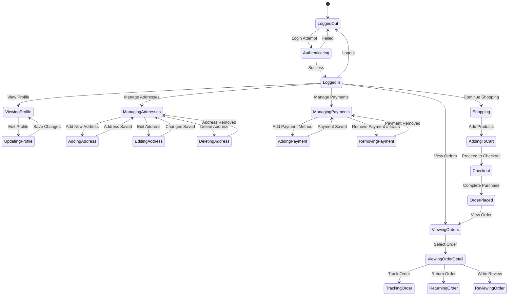

## 👨‍💼 Admin User Journey

### Admin Dashboard & Management

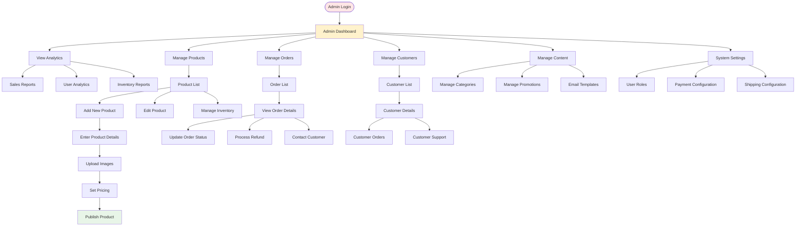

### Order Management Flow

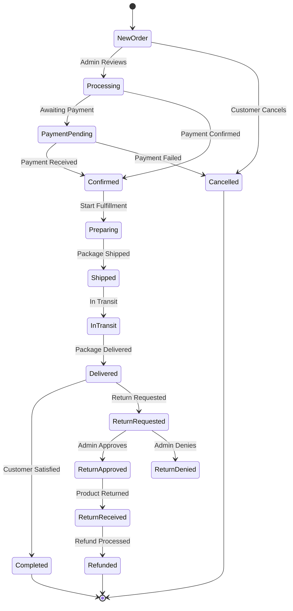

## 📱 Mobile App Journey

### Mobile-First Experience

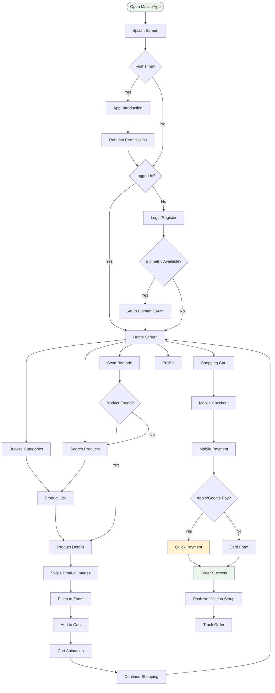

### Mobile Checkout Optimization

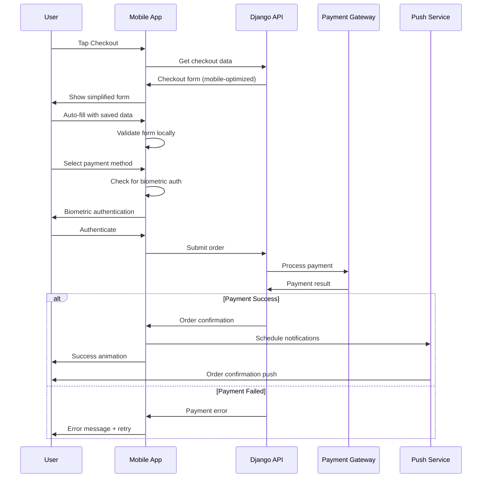

## ⚠️ Error Handling Flows

### Common Error Scenarios

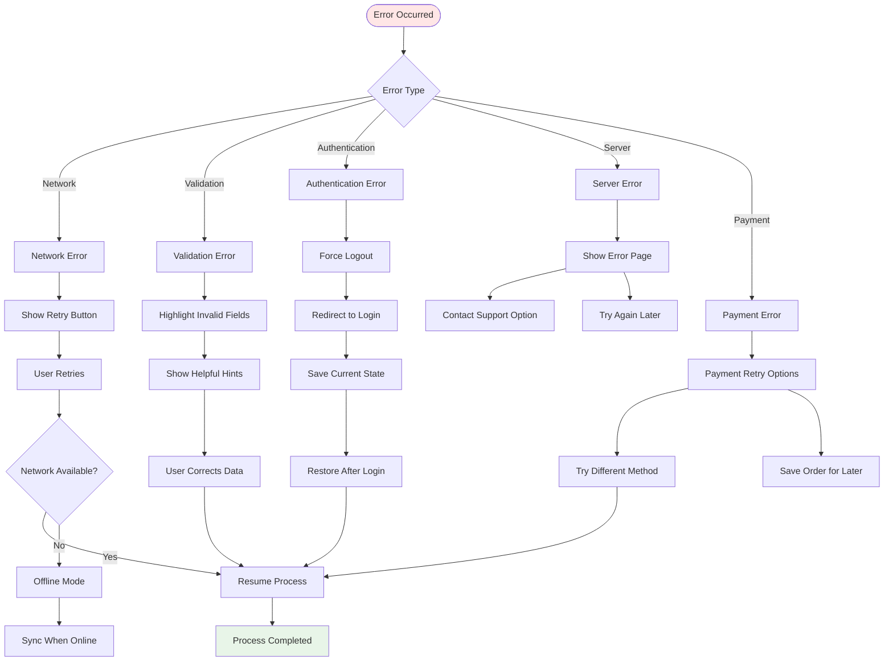

### Progressive Error Recovery

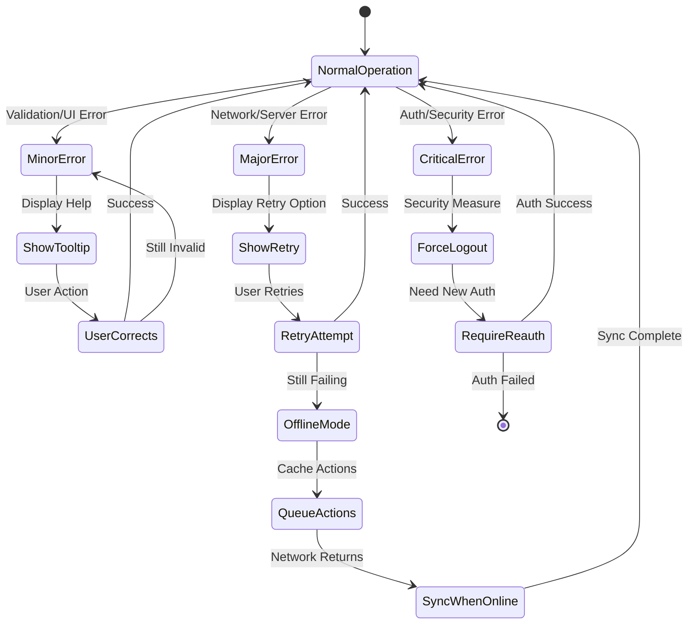

## ♿ Accessibility Considerations

### Inclusive Design Patterns

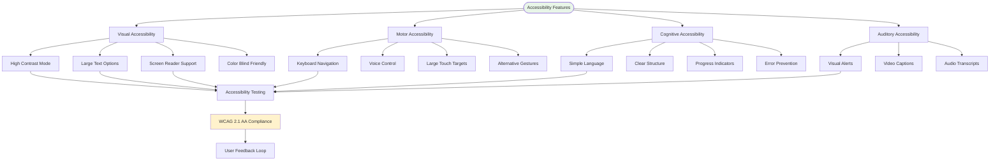

This comprehensive user journey documentation ensures that the Django Ecommerce API provides excellent user experiences across all user types and interaction methods, with proper consideration for accessibility and error handling.
