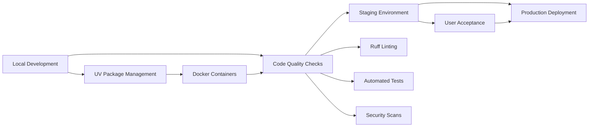
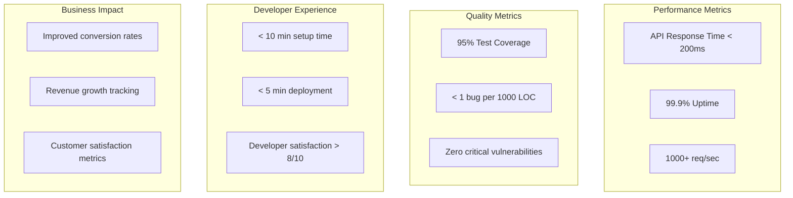

# 🏗️ System Design & Technical Architecture

## 🎯 Overview

The ecommerce platform is built as a modern, scalable Django application with enhanced organizational structure and advanced tooling. It provides a comprehensive set of APIs for managing products, orders, carts, and user interactions, with built-in ML capabilities, enhanced developer experience, and production-ready architecture.

### ✨ Key Improvements & Features

- **🔧 Modern Tooling**: UV package management, enhanced Ruff configuration, comprehensive Makefile
- **📁 Organized Structure**: Modular models, utilities, and configuration management
- **🚀 Developer Experience**: Automated setup scripts, code quality tools, deployment automation
- **📊 Comprehensive Documentation**: Architecture diagrams, user journeys, API documentation
- **🐳 Containerized**: Docker-based development and deployment with multi-environment support

## Architecture

### Backend Architecture

- Monolithic Django 4.2+ application
- Django Ninja Extra for API development
- PostgreSQL for primary database
- Redis for caching and session management
- Celery for background tasks
- S3 for file storage
- Stripe for payment processing

### Machine Learning Integration

- Product recommendation engine
- Search ranking optimization
- Customer segmentation
- Demand forecasting
- Fraud detection
- All ML models are integrated within Django using:
  - PyTorch for model training and inference
  - Celery for asynchronous model predictions
  - Redis for caching predictions
  - PostgreSQL for storing model outputs

## 🧩 Core Components

### Enhanced Project Structure

```
ecommerce-api/
├── api/                    # Core configuration & shared utilities
│   ├── config/            # ✨ NEW: Centralized configuration
│   │   ├── constants.py   # Application constants
│   │   ├── error_messages.py # Standardized messages
│   │   └── settings.py    # Runtime settings
│   └── utils/             # ✨ NEW: Organized utility modules
│       ├── cache.py       # Cache utilities
│       ├── email.py       # Email helpers
│       ├── validation.py  # Data validation
│       └── ...
├── core/                  # User management & core models
│   └── models/            # ✨ NEW: Separated model files
│       ├── user.py
│       ├── customer.py
│       └── ...
├── products/              # Product catalog
│   └── models/            # ✨ NEW: Organized product models
├── cart/                  # Shopping cart
│   └── models/            # ✨ NEW: Cart-specific models
├── orders/                # Order management
│   └── models/            # ✨ NEW: Order-related models
├── payments/              # Payment processing
│   └── models/            # ✨ NEW: Payment models
└── scripts/               # ✨ NEW: Enhanced development scripts
    ├── dev_setup.sh       # Complete development setup
    ├── code_quality.sh    # Quality assurance
    └── deploy.sh          # Deployment automation
```

### API Layer (Django Ninja Extra)

- RESTful API endpoints with OpenAPI documentation
- JWT authentication with refresh token support
- Comprehensive request validation using Pydantic
- Structured response serialization
- API versioning with backward compatibility
- Intelligent rate limiting with user-based quotas
- Auto-generated interactive documentation (Swagger/ReDoc)

### Database Design

- PostgreSQL for primary data storage
- Redis for:
  - Session management
  - Cache layer
  - Real-time analytics
  - Queue management
- Database optimization:
  - Proper indexing
  - Query optimization
  - Connection pooling
  - Read replicas (production)

### Caching Strategy

- Multi-level caching:
  - Application-level caching
  - Database query caching
  - API response caching
  - Session caching
- Cache invalidation patterns
- Cache warming strategies

### Background Processing

- Celery for async tasks:
  - Order processing
  - Email notifications
  - ML model training
  - Report generation
  - Data exports
- Task prioritization
- Error handling and retries
- Task monitoring

### File Storage

- S3 for:
  - Product images
  - User uploads
  - Generated reports
  - Backup storage
- Image processing:
  - Thumbnail generation
  - Image optimization
  - Format conversion

### Security

- JWT authentication
- Role-based access control
- API rate limiting
- Input validation
- XSS protection
- CSRF protection
- SQL injection prevention
- Security headers
- SSL/TLS encryption

## Machine Learning Features

### Product Recommendations

- Collaborative filtering
- Content-based filtering
- Hybrid recommendations
- Real-time personalization
- A/B testing framework

### Search Optimization

- Semantic search
- Autocomplete suggestions
- Typo tolerance
- Relevance ranking
- Search analytics

### Customer Analytics

- Customer segmentation
- Churn prediction
- Lifetime value prediction
- Purchase pattern analysis
- Cohort analysis

### Inventory Management

- Demand forecasting
- Stock optimization
- Reorder point prediction
- Seasonal trend analysis
- Supplier performance analysis

### Fraud Detection

- Transaction analysis
- Behavior patterns
- Risk scoring
- Anomaly detection
- Real-time alerts

## Monitoring and Analytics

### Application Monitoring

- Performance metrics
- Error tracking
- Resource utilization
- API metrics
- User activity

### Business Analytics

- Sales metrics
- Customer metrics
- Product metrics
- Marketing metrics
- Financial metrics

### ML Model Monitoring

- Model performance
- Prediction accuracy
- Feature importance
- Data drift detection
- Model retraining triggers

## 🚀 Enhanced Deployment & DevOps

### Modern Development Workflow



### Infrastructure

- **🐳 Docker**: Multi-stage containerization with optimized images
- **🌐 Nginx**: Reverse proxy with security headers and SSL termination
- **🦄 Gunicorn**: WSGI server with worker process management
- **⚖️ Load Balancing**: Horizontal scaling with health checks
- **📈 Auto-scaling**: Resource-based scaling policies

### Enhanced CI/CD Pipeline

- **🧪 Quality Gates**: Comprehensive testing with coverage requirements
- **🔍 Code Analysis**: Ruff linting, MyPy type checking, security scanning
- **🔒 Security**: Vulnerability scanning, dependency checks, secret detection
- **🚀 Deployment**: Blue-green deployments with automated rollback
- **📊 Monitoring**: Real-time performance and error tracking

### Environment Strategy

- **🛠️ Development**: Local Docker Compose with UV package management
- **🧪 Staging**: Production-like environment for integration testing
- **🌟 Production**: High-availability setup with monitoring and alerting
- **🤖 ML Training**: Dedicated environment for model development
- **🔬 ML Staging**: Model validation and A/B testing environment

### Modern Tooling Integration

#### Package Management with UV

```bash
# Fast dependency installation
uv pip install -e .

# Development dependencies
uv pip install -e ".[dev]"

# Lock file management
uv lock
```

#### Enhanced Makefile Commands

```bash
# Complete setup
make setup

# Quality assurance
make check
make fix

# Testing
make test
make test-coverage

# Deployment
make prod-deploy
```

#### Automated Scripts

- **`dev_setup.sh`**: One-command development environment setup
- **`code_quality.sh`**: Comprehensive quality checks
- **`deploy.sh`**: Multi-environment deployment with safety checks

## Scalability Considerations

### Application Scaling

- Horizontal scaling
- Load balancing
- Database sharding
- Caching optimization
- Connection pooling

### ML Scaling

- Model serving optimization
- Batch prediction processing
- Feature store implementation
- Model versioning
- A/B testing infrastructure

## 🔮 Future Enhancements & Roadmap

### ✨ Completed Improvements (This Release)

- **📁 Modular Architecture**: Separated models into organized folder structures
- **🔧 Modern Tooling**: UV package management integration
- **📝 Enhanced Configuration**: Centralized constants and error message management
- **🛠️ Developer Experience**: Comprehensive scripts and Makefile improvements
- **📚 Documentation**: Architecture diagrams, user journeys, and technical docs
- **🎯 Code Quality**: Enhanced Ruff configuration with better error handling

### 🎯 Planned Features (Next Phase)

#### Technical Enhancements

- **🔄 GraphQL API**: Alternative to REST for complex queries
- **📱 Mobile-First API**: Optimized endpoints for mobile applications
- **🌐 Multi-tenancy**: Support for multiple storefronts
- **🔄 Event Sourcing**: Enhanced audit trails and data consistency
- **🔍 Advanced Search**: Elasticsearch integration with ML-powered relevance

#### ML & AI Capabilities

- **🤖 Enhanced Recommendations**: Deep learning models for personalization
- **💬 Chatbot Integration**: AI-powered customer support
- **📊 Predictive Analytics**: Advanced business intelligence
- **🖼️ Visual Search**: Image-based product discovery
- **🔊 Voice Commerce**: Voice-activated shopping experience

#### Performance & Scalability

- **⚡ Performance Optimization**: Query optimization and caching strategies
- **🔄 Real-time Features**: WebSocket integration for live updates
- **📈 Advanced Monitoring**: Distributed tracing and observability
- **🚀 Edge Computing**: CDN integration for global performance
- **🔧 Microservices Migration**: Gradual decomposition for specific domains

### 🛠️ Technical Debt Reduction

#### Code Quality

- **✅ Test Coverage**: Achieve 95% test coverage across all modules
- **🔍 Type Safety**: Complete MyPy type annotations
- **📚 Documentation**: API documentation and development guides
- **🔒 Security Hardening**: Regular security audits and updates
- **♿ Accessibility**: WCAG 2.1 AA compliance

#### Infrastructure Modernization

- **☸️ Kubernetes Migration**: Container orchestration for production
- **🔄 CI/CD Enhancement**: GitOps workflows and automated deployments
- **📊 Observability**: Enhanced monitoring and alerting systems
- **🔐 Secret Management**: Secure handling of sensitive configuration
- **🌍 Multi-region Deployment**: Global availability and disaster recovery

### 📈 Success Metrics



This enhanced system design provides a solid foundation for scaling the ecommerce platform while maintaining high code quality, developer productivity, and operational excellence.
